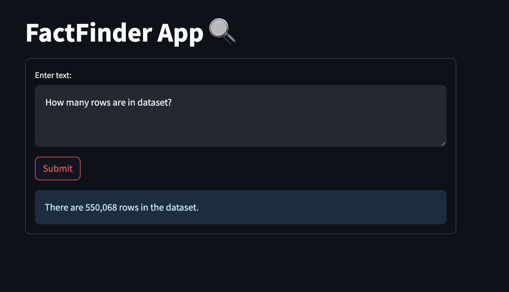
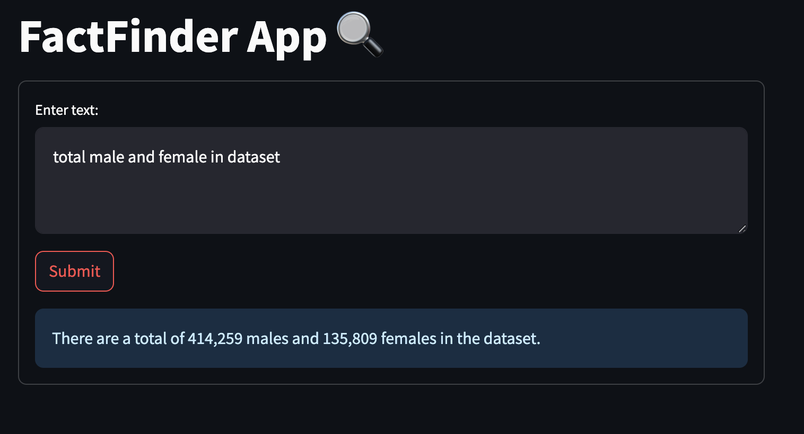
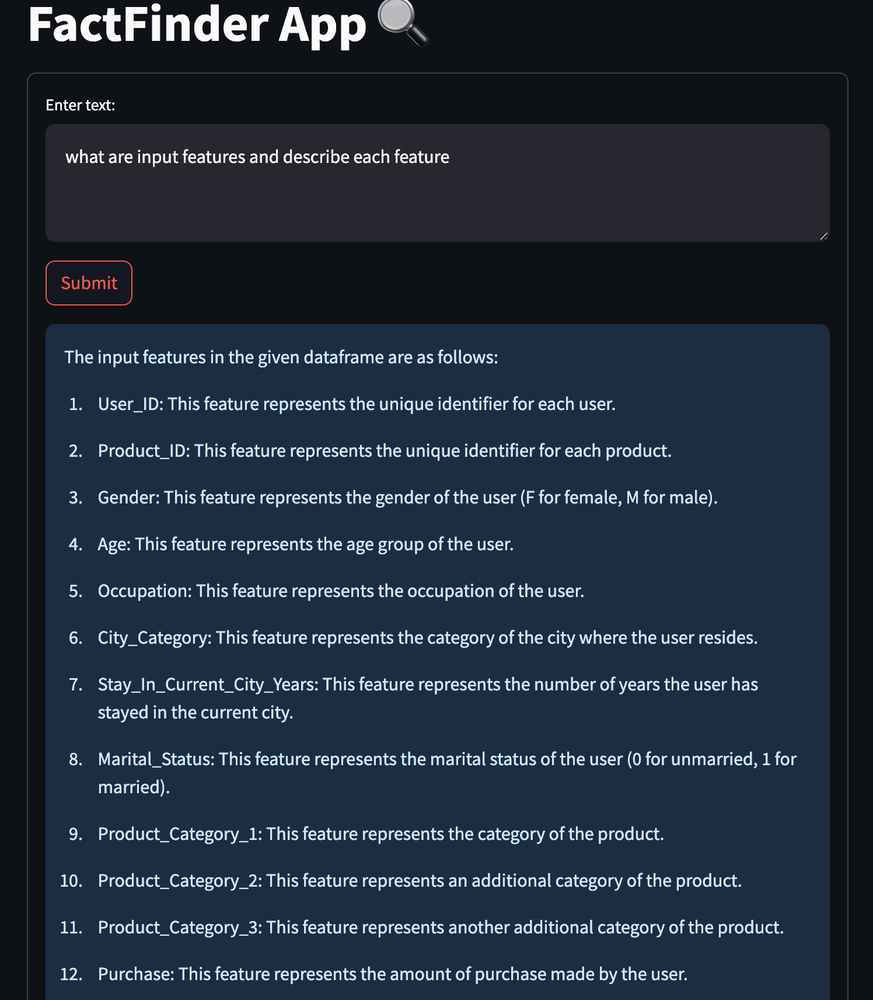

# CSV Query Solver 📊

Welcome to the CSV Query Solver, a straightforward app designed to answer user queries from a specified CSV dataset. Powered by GPT-based Language Model (LLM) via Langchain, the app generates Python code dynamically based on user queries, executes the code using the input dataset, and produces the corresponding output.

## Features:
- Efficiently handles user queries on CSV datasets.
- Utilizes the GPT LLM for intelligent code generation.
- Streamlit-based interface for a user-friendly experience.





## Setup:
Create a `.env` file with the following environment variables:
- OPENAI API key
- Dataset path
- LLM Temperature
- LLM Model Name

## Install Requirements:
Ensure you have the required Python dependencies by running the following command:
```
pip install -r requirements.txt
```
## Usage:
To run the app, execute the following command:
```
streamlit run app.py
```